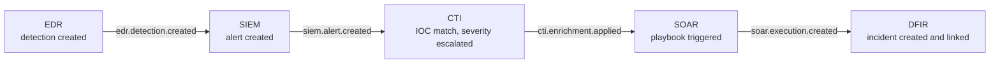
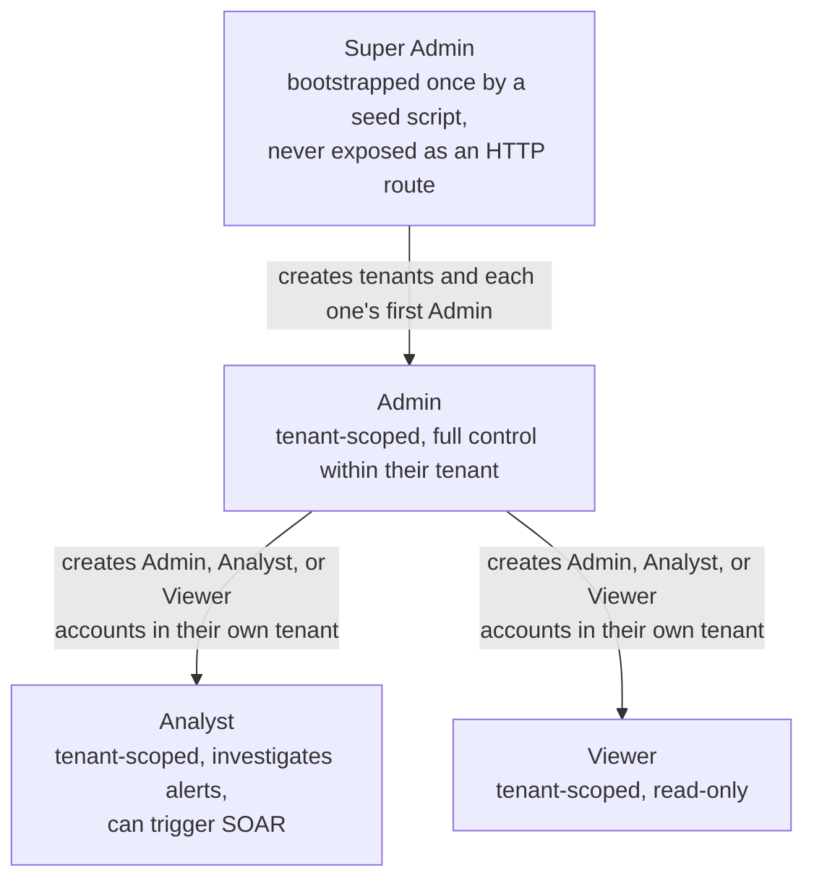

# SecOps backend

The API for SecOps, a multi-tenant security operations platform that brings SIEM, SOAR,
CTI, EDR, DFIR, and vulnerability management into one workspace per tenant. Built with
NestJS and PostgreSQL as the backend half of a software engineering internship project.

This service is the integration and orchestration layer. It does not reimplement detection
engines, automation runners, or threat intelligence feeds. It ingests their output,
normalizes it into one shape, stores it, enforces who can see and do what, and wires the six
modules together so an event in one shows up as a finding in another. Every module currently
reads from a mock adapter standing in for a real vendor feed. That is a deliberate,
documented gap: the rest of the system (storage, RBAC, orchestration, real-time delivery) is
real and tested against it, and swapping the mock adapter for a real one per vendor is future
work that needs that vendor's API documentation first.

The companion frontend lives in a separate repository, [frontend-gerance](../frontend), and
talks to this API exclusively through its own server-side proxy layer, never directly from
the browser.

## Contents

- [Architecture](#architecture)
- [Authentication and session security](#authentication-and-session-security)
- [Tech stack](#tech-stack)
- [Database schema](#database-schema)
- [Getting started](#getting-started)
- [Environment variables](#environment-variables)
- [API surface](#api-surface)
- [Testing](#testing)
- [Docker and CI/CD](#docker-and-cicd)
- [Known limitations](#known-limitations)
- [Project layout](#project-layout)
- [Further reading](#further-reading)

## Architecture

### A modular monolith, not microservices

Every module runs in one NestJS process against one PostgreSQL database. This was a
deliberate choice over microservices: at this scale, splitting SIEM, SOAR, CTI, EDR, DFIR,
and VM into six separately deployed services would add network calls, service discovery, and
distributed-transaction concerns without a corresponding benefit. Modules stay decoupled at
the code level instead, through a shared contract and an internal event bus, so they could be
peeled off into real services later if the platform ever needed to scale that way.

### Shared-database multi-tenancy

Every tenant-scoped table carries a `tenantId` column, and every query that reads or writes
one is scoped by the caller's own tenant, taken from their JWT rather than from anything the
request body supplies. There is no per-tenant database or schema. This keeps operations
simple for a platform with many tenants, at the cost of needing that scoping to be correct on
every single query. To keep that discipline consistent, tenant scoping is centralized in
shared helpers (`requireTenantId`, and the per-module service methods that build on it)
rather than repeated by hand in each controller.

### One contract for every module

SIEM, SOAR, CTI, EDR, DFIR, and VM each implement the same interface, so the orchestration
layer never needs to know which concrete module produced or handled an event:

```ts
interface SecurityModule<TRecord, TFilters extends BaseQueryFilters> {
  ingest(event: UnifiedEvent): Promise<void>;
  query(filters: TFilters): Promise<TRecord[]>;
  healthCheck(): Promise<ModuleHealth>;
}
```

Every event flowing between modules is normalized into one envelope before anything acts on
it, so a downstream module only ever has to understand one shape regardless of where the
event originated:

```ts
interface UnifiedEvent {
  tenantId: string;
  timestamp: string;
  source: ModuleName; // SIEM | SOAR | CTI | EDR | DFIR | VM
  type: EventType; // alert | event | detection | ioc | vulnerability
  severity: Severity; // LOW | MEDIUM | HIGH | CRITICAL
  data: Record<string, unknown>;
}
```

### Event-driven orchestration

Modules talk to each other through NestJS's internal event emitter, never through direct
service calls or HTTP requests to one another. An EDR detection can escalate all the way into
a DFIR incident without any module holding a reference to the next one in the chain:



Every record any module creates also emits a plain `*.created` event, consumed by a seventh,
read-only piece: an asset aggregator that writes a denormalized row into one materialized
table (`AssetFeedEntry`). This is what backs the cross-module dashboard feed and the
real-time event stream, without a live fan-out query across all six modules on every page
load.

### User provisioning and role-based access control

There is no public sign-up. Every account is created by someone above it in the hierarchy:



The rules that follow from this shape are enforced in code, not just documented:

- No `/auth/register` endpoint exists, and none is planned.
- A new user's tenant always comes from the creator's own auth token, never from the request
  body. A compromised Admin token can create users, but only inside its own tenant.
- A new user's role is decided by which endpoint is called, never by a client-supplied field.
- An Admin cannot delete their own account, change their own role, or reset their own
  password through the admin-reset endpoint, closing off a few obvious self-privilege paths.
- The last Admin in a tenant cannot be demoted or deleted, so a tenant can never end up with
  no one able to manage it.
- The first Super Admin is created by a one-time seed script that reads credentials from
  environment variables and writes directly to the database. There is no API path to create
  one, since no authenticated caller could exist before it does.

## Authentication and session security

Access tokens are short-lived JWTs (15 minutes), delivered in the response body. A longer
lived refresh token is delivered separately as an httpOnly cookie, rotated on every use: each
refresh call revokes the token that was just presented and issues a new one in the same
token family. If a revoked token is ever presented again, the entire family is revoked,
which is what a stolen and replayed token would look like from a legitimate client's own
device losing its latest token. Logout revokes only the current session, not every session
for that user.

A few more layers sit on top of that:

- Five consecutive failed login attempts lock an account for fifteen minutes. Locked and
  wrong-password responses are identical, so a caller cannot use the response itself to learn
  whether an account exists or is currently locked.
- Login always runs a full password verification, even when the email does not match any
  account, against a fixed dummy hash. Skipping that step for a nonexistent user would make
  the response time itself distinguish real accounts from fake ones.
- A permanent, append-only history of password hashes prevents reusing any of the last five
  passwords on a self-change or an admin-initiated reset.
- A `Secure` flag on the refresh-token cookie is gated behind a dedicated `HTTPS_ENABLED`
  environment variable, not `NODE_ENV`. A production build is not the same claim as "this is
  actually served over TLS," and conflating the two silently drops the cookie the moment this
  service runs behind plain HTTP on anything other than `localhost`.

## Tech stack

- NestJS 11 on Node.js 22
- PostgreSQL, accessed through Prisma 7 with the `@prisma/adapter-pg` driver adapter, which
  compiles queries through a portable WASM query engine rather than a platform-specific
  native binary
- `argon2` for password hashing, `class-validator` and `class-transformer` for DTO validation
- `@nestjs/throttler` for rate limiting, `@nestjs/event-emitter` for the orchestration bus,
  `@nestjs/schedule` for the polling skeleton described below, `@nestjs/terminus` for the
  health check, `helmet` for baseline security headers

## Database schema

Three platform-level models sit underneath everything: `Tenant`, `User` (with its role,
lockout counters, and password-history relation), and `TenantModule` (which modules a given
tenant has activated). Each of the six security modules owns its own tables, all carrying a
`tenantId` and a `rawData` JSON column that preserves whatever the original ingested payload
looked like, so normalizing known fields into real relational columns never means losing the
rest of the payload:

| Module | Tables |
|---|---|
| SIEM | `SiemLog`, `SiemAlert` |
| EDR | `EdrEndpoint`, `EdrDetection` |
| CTI | `CtiIoc` |
| SOAR | `SoarPlaybook`, `SoarExecution` |
| DFIR | `DfirIncident`, `DfirLink` |
| VM | `VmAsset`, `VmVulnerability` |

`AssetFeedEntry` is the materialized cross-module feed described above. The full schema,
including every field, index, and relation, is in `prisma/schema.prisma`.

## Getting started

### Requirements

- Node.js 22 or later
- Docker and the Docker Compose plugin, for the quick-start path below
- PostgreSQL 18, if you would rather run it yourself instead of through Compose

### Quick start with Docker Compose

The compose file lives one directory up, at the repository root, since it also starts the
frontend and Postgres. From there:

```bash
cp .env.example .env   # fill in POSTGRES_* and JWT_SECRET
docker compose up -d
docker compose run --rm seed   # bootstraps the first Super Admin from prisma/seed-data.json
```

This brings up Postgres, applies every migration, and starts both the backend and the
frontend with a real dependency order: Postgres has to report healthy before migrations run,
and migrations have to finish before the backend starts. The backend is only reachable from
other containers on the compose network, not from your host, by design; talk to it through
the frontend on `http://localhost:3001`.

### Manual setup, without Docker

```bash
npm install
cp .env.example .env   # fill in DATABASE_URL, JWT_SECRET, FRONTEND_URL

npx prisma migrate deploy
npx prisma generate
npx prisma db seed        # bootstraps the first Super Admin(s), needs prisma/seed-data.json

npm run start:dev
```

`prisma/seed-data.json` is gitignored on purpose. It holds real credentials for the first
Super Admin account and is never committed. Create it yourself, following the shape
`prisma/seed.ts` expects, before running the seed command.

Once you have a running server and at least one tenant, `npm run seed:demo` populates five
demo tenants with around 3,500 records spread across all six modules, useful for exploring
the app without hand-creating data.

## Environment variables

| Variable | Required | Default | Purpose |
|---|---|---|---|
| `DATABASE_URL` | yes | none | PostgreSQL connection string |
| `JWT_SECRET` | yes | none | Signs access and refresh tokens. The app refuses to start without it |
| `FRONTEND_URL` | yes | none | Exact origin of the frontend, needed for CORS since the refresh cookie requires `credentials: true`, which is incompatible with a wildcard origin |
| `PORT` | no | `3000` | HTTP port the server listens on |
| `HTTPS_ENABLED` | no | `false` | Set to `true` only when a real TLS-terminating proxy sits in front of this service. Governs the refresh-token cookie's `Secure` flag |

## API surface

Every route is served under a global `/api` prefix, for example `POST /api/auth/login`, not
`POST /auth/login`.

- `GET /api/health` is public and reports per-dependency status (database, memory), useful
  for uptime checks and for seeing at a glance which dependency is down.
- Each of the six modules exposes ingestion, query, and (except CTI and SOAR, whose data
  does not model an "investigation" the way an alert or incident does) assign and status
  routes, all behind the role rules above.
- `GET /api/assets/feed` returns the paginated, cross-module activity feed.
- `GET /api/events/stream` is a Server-Sent Events endpoint, tenant-filtered, delivering
  every module's create, assign, status-change, and unassign events in real time.
- A Postman collection in `postman/` propagates a bearer token automatically once you log in
  through it, for manual testing without wiring up curl by hand.

## Testing

```bash
npm run test        # unit tests
npm run test:e2e    # end-to-end tests, against a real guard chain with a mocked PrismaService
npm run test:cov    # coverage report
```

The suite currently stands at 507 unit tests and 187 end-to-end tests, covering every guard,
service method, controller route, and tenant-isolation boundary described above. The
end-to-end layer has caught real defects unit tests structurally could not: a fully built and
tested controller that was never wired into its module, and, more than once, a delete
endpoint that crashed on a foreign key it forgot to clean up first.

## Docker and CI/CD

`Dockerfile` is a three-stage build: `builder` compiles the app and generates the Prisma
client, `migrator` carries the Prisma CLI and everything needed to run migrations and seeds
as one-off jobs, and `runner` is the always-running image, stripped down to just the compiled
output and production dependencies. Splitting `migrator` out of `runner` this way took the
always-running image from 925MB down to 515MB.

Two GitHub Actions workflows sit alongside the existing test suite:

- `build.yml` runs a SonarCloud scan on every push and pull request, then, only on a push to
  `main`, builds and pushes the runner and migrator images to GitHub Container Registry.
- `deploy.yml` triggers once `build.yml` succeeds on `main`, and deploys the migration job
  followed by the backend service over SSH.

Both are written for a single-VM deployment target and never touch the Postgres container
that instance runs, which is provisioned once, by hand.

## Known limitations

- Every module ingests from a mock adapter rather than a real vendor API. Building real
  per-vendor adapters is future work, blocked on getting that vendor's API documentation, not
  on anything in this codebase.
- There is no machine-to-machine authentication (API keys) for the six modules' ingestion
  routes yet. They currently sit behind the same JWT auth a human user would use, as a
  deliberate stand-in until a real vendor integration needs its own credential type.
- No pre-commit hooks on this repository. Linting, type-checking, and formatting run in CI
  and can be run manually, but nothing blocks a commit locally today.
- One moderate `npm audit` finding, in a transitive dependency of Prisma's own CLI tooling
  (not a runtime dependency of the deployed app), is deliberately left unresolved because the
  available fix requires downgrading Prisma to a version that breaks this project's driver
  adapter setup.

## Project layout

```
src/
  auth/          login, refresh-token rotation, lockout, password reuse prevention
  users/         self-service profile routes, Admin CRUD over subordinate users
  tenants/       Super Admin tenant provisioning and module activation
  {vm,edr,siem,cti,soar,dfir}/   the six security modules, each following the
                 SecurityModule contract
  asset/         the cross-module materialized feed
  events/        the Server-Sent Events stream
  polling/       the scheduled ingestion skeleton and its mock adapter
  common/        shared types, guards, and the assign/status-transition RBAC helpers
                 reused across all four assignable modules
prisma/
  schema.prisma  the full database schema
  seed.ts        one-time Super Admin bootstrap
  seed-modules.ts   demo dataset generator (npm run seed:demo)
test/            end-to-end specs, one file per module plus auth and security hardening
```

## Further reading

`CLAUDE.md` in this repository has the full, itemized architecture and decision log this
README summarizes, including the exact phase-by-phase build history for each module.
`docs/internship-report-backend.md` is the complete chronological development log, with the
reasoning behind every non-obvious decision and every bug found along the way.
