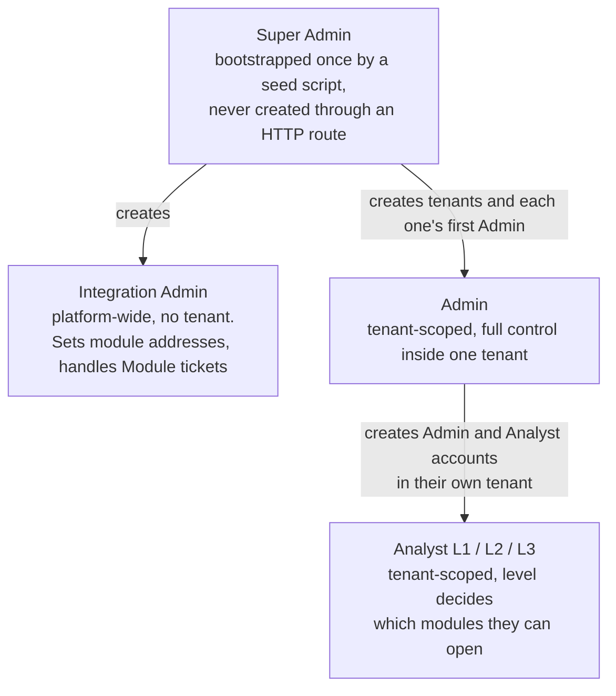
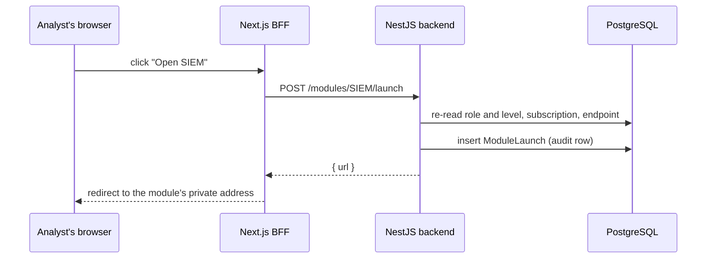

# SecOps backend

The API for SecOps, a multi-tenant platform that gives each client organization one place to
reach its security tooling: SIEM, SOAR, CTI, EDR, DFIR, and vulnerability management. Built
with NestJS and PostgreSQL as the backend half of an internship project.

SecOps does not ingest, store, or display the data those tools produce. Each of the six
modules is a real external product, one shared instance per module, running on a private
address that is not exposed to the internet. This service decides who may open which module,
sends them there, and gives them a ticketing channel to the people who run the platform. That
is a change from the first version, which ingested mock data from each module and rendered it
in the app. The supervisor redefined the scope after the first demo, and the data layer was
removed (see [What changed in v2](#what-changed-in-v2)).

The companion frontend lives in a separate repository, [frontend-gerance](../frontend), and
talks to this API only through its own server-side proxy layer, never directly from the
browser.

## Contents

- [What changed in v2](#what-changed-in-v2)
- [Architecture](#architecture)
- [Authentication and session security](#authentication-and-session-security)
- [Rate limiting](#rate-limiting)
- [Tech stack](#tech-stack)
- [Database schema](#database-schema)
- [Getting started](#getting-started)
- [Environment variables](#environment-variables)
- [API surface](#api-surface)
- [Testing](#testing)
- [Docker and CI/CD](#docker-and-cicd)
- [Known limitations](#known-limitations)
- [Project layout](#project-layout)
- [Further reading](#further-reading)

## What changed in v2

The redesign came in four phases, each one built, tested, and committed on its own.

1. The module data layer was removed. The twelve module tables, the `SecurityModule`
   contract, the mock adapter, the poller, and the orchestration between modules are gone.
2. Roles changed. `VIEWER` no longer exists. `INTEGRATION_ADMIN` is new, and every Analyst
   now has a level, L1, L2, or L3.
3. Modules became a registry of endpoints. An Integration Admin sets each module's address
   and port, and a launch is a redirect to it.
4. Ticketing and notifications were added, with live delivery over Server-Sent Events.

Measured against the last commit of the first version, the backend gained 4,099 lines and
lost 15,888 across 144 files, and the schema went from 17 models to 9.

## Architecture

### A modular monolith, not microservices

Everything runs in one NestJS process against one PostgreSQL database. With the module data
gone, the application is small enough that splitting it into services would add network
calls and deployment work for no benefit. The codebase is still organized by feature
(`auth`, `users`, `tenants`, `module-access`, `tickets`, `events`), so a feature could be
moved out later without untangling it first.

### Shared-database multi-tenancy

Every tenant-scoped table carries a `tenantId`, and every query that reads or writes one is
scoped by the caller's own tenant, taken from their JWT and never from the request body.
There is no per-tenant database or schema. The scoping has to be correct on every query, so
it lives in a shared helper, `requireTenantId`, instead of being repeated in each controller.

### Roles and provisioning

There is no public sign-up. Every account is created by someone above it in the hierarchy:



The rules that follow from this shape are enforced in code:

- No `/auth/register` endpoint exists.
- A new user's tenant comes from the creator's token. A compromised Admin token can create
  users, but only inside its own tenant.
- A new user's role comes from which endpoint is called, never from a request field. The one
  choice an Admin makes is `ADMIN` or `ANALYST`, and an Analyst must come with a level.
- A database `CHECK` constraint (`User_analystLevel_matches_role`) guarantees every Analyst
  has a level and nobody else does. The service returns the same rule as a 400 before the
  database is reached.
- An Admin cannot delete themselves, change their own role, or reset their own password
  through the admin-reset route. The last Admin of a tenant cannot be demoted or deleted.
- The Integration Admin is platform-wide and does one job: edit module endpoints and handle
  Module tickets. It cannot see any tenant's users.

### Module access and launch

Each module has one platform-wide endpoint (protocol, host, port, path), edited only by the
Integration Admin. Each tenant has a subscription per module, activated by the Super Admin,
with a minimum analyst level that the tenant's own Admin can change. The starting levels are:

| Level | Modules it can open by default |
|---|---|
| L1 | CTI, VM |
| L2 | L1's, plus SIEM and EDR |
| L3 | all six, adding SOAR and DFIR |

Admins can open every active module. A launch works like this:



The backend re-reads the user's role and level from the database on every launch, because a
JWT can be up to 15 minutes stale. A launch is a plain redirect. It does not carry the
user's login into the module. Single sign-on is the planned next step, and it depends on
which product runs behind each module, so it is deliberately not guessed at here. The
platform never forwards or stores a password for a module.

The Integration Admin can also press "Test connection", which opens a TCP connection from
the backend to the configured address with a 3 second timeout and reports whether it is
reachable. Because that probe runs on the backend host, the backend has to be able to reach
the modules' network, and so do the users' browsers for the redirect itself.

### Tickets and notifications

Any Admin or Analyst can raise a ticket with a title, a description, and a category:
`MODULES` (with the affected module), `ACCOUNT_ACCESS`, or `OTHER`. What each role sees and
can do is decided in `TicketsService`:

| Role | Sees | Can change status |
|---|---|---|
| Analyst | their own tickets | withdraw their own ticket (to `RESOLVED`) |
| Admin | every ticket in their tenant | yes |
| Integration Admin | `MODULES` tickets from every tenant | yes |
| Super Admin | none | no |

Handlers move a ticket `OPEN` to `IN_PROGRESS` or `RESOLVED`, `IN_PROGRESS` to `OPEN` or
`RESOLVED`, and can reopen a `RESOLVED` ticket. A ticket a caller is not allowed to see
answers 404, the same as one that does not exist.

A new ticket notifies every recipient except its creator: the tenant's Admins, plus every
Integration Admin when the category is `MODULES`. A status change notifies the creator.
Notifications are stored, so they survive a closed browser, and are also pushed live over
`GET /api/events/stream`. That stream is per user, not per tenant, which is what lets
tenant-less Integration Admins receive theirs.

## Authentication and session security

Access tokens are short-lived JWTs (15 minutes) delivered in the response body. The claims
are `sub`, `role`, `analystLevel`, `tenantId`, and `mustChangePassword`. A longer-lived
refresh token is delivered separately as an httpOnly cookie and rotated on every use: each
refresh revokes the presented token and issues a new one in the same family. If a revoked
token is ever presented again, the whole family is revoked, which is what a replayed stolen
token looks like. Logout revokes only the current session.

Several more layers sit on top:

- Five consecutive failed logins lock an account for fifteen minutes. Locked and
  wrong-password responses are identical, so the response cannot be used to learn whether an
  account exists or is locked.
- Login always runs a full password verification, against a fixed dummy hash when the email
  matches no account, so response time does not separate real accounts from fake ones.
- An append-only history of password hashes blocks reusing any of the last five passwords.
- New accounts and admin-reset accounts must change their password at first login. A global
  guard blocks every other route until they do.
- The `Secure` flag on the refresh cookie is controlled by `HTTPS_ENABLED`, not `NODE_ENV`,
  since a production build is not proof that TLS is actually in front of the service.

Global guards run in a fixed order: JWT authentication, role check, must-change-password,
then rate limit. The order matters because each one reads what the previous one set.

## Rate limiting

A security audit of the v2 changes found that the throttle only protected the auth routes,
and that behind the frontend proxy every request appeared to come from one address, so the
5 per minute login limit was a single bucket for the whole platform. Anyone could lock every
user out of logging in. The fix has three parts:

- `UserThrottlerGuard` is the last global guard. Signed-in requests are counted per user id,
  anonymous ones per client IP.
- `main.ts` sets Express's `trust proxy` (from `TRUST_PROXY`, default
  `loopback, uniquelocal`), and the frontend forwards the client address in `X-Forwarded-For`, so
  `req.ip` is the real client. A client reaching the backend directly from a public address
  cannot spoof it.
- The limits are 120 per minute by default, 5 for the auth routes, 10 for creating a ticket,
  and 20 for the connection test. `/health` is exempt.

## Tech stack

- NestJS 11 on Node.js 22
- PostgreSQL 18, accessed through Prisma 7 with the `@prisma/adapter-pg` driver adapter,
  which compiles queries through a portable WASM engine instead of a native binary
- `argon2` for password hashing, `class-validator` and `class-transformer` for DTO validation
- `@nestjs/throttler` for rate limiting, `@nestjs/event-emitter` for the notification relay,
  `@nestjs/schedule` for the nightly refresh-token cleanup, `@nestjs/terminus` for the
  health check, `helmet` for baseline security headers

## Database schema

Nine models. The migrations that made v2 are the last four in `prisma/migrations/`.

| Model | Purpose |
|---|---|
| `Tenant` | a client organization |
| `User` | any account; role, optional analyst level, lockout counters |
| `PasswordHistory`, `RefreshToken` | password reuse prevention and token rotation |
| `TenantModule` | which modules a tenant has, and each one's minimum analyst level |
| `ModuleEndpoint` | one row per module: protocol, host, port, path (platform-wide) |
| `ModuleLaunch` | audit trail of launches, with snapshot columns and no foreign keys so it survives user and tenant deletion |
| `Ticket` | title, description, category, optional module, status |
| `Notification` | one row per recipient and ticket event, with `readAt` |

Some rules live in the database as well as in code, through hand-written `CHECK`
constraints Prisma cannot express: analyst level matches role, a ticket's module is set
exactly when its category is `MODULES`, and a module port is between 1 and 65535. The full
schema is in `prisma/schema.prisma`.

## Getting started

### Requirements

- Node.js 22 or later
- Docker and the Docker Compose plugin, for the quick-start path
- PostgreSQL 18, if you would rather run it yourself

### Quick start with Docker Compose

The compose file lives one directory up, at the repository root, because it also starts the
frontend and Postgres. From there:

```bash
cp .env.example .env   # fill in POSTGRES_* and JWT_SECRET
docker compose up -d
docker compose run --rm seed                    # first Super Admin, from prisma/seed-data.json
docker compose run --rm seed npm run seed:demo  # optional: five demo tenants
```

Postgres has to report healthy before migrations run, and migrations have to finish before
the backend starts. The backend is reachable only from other containers on the compose
network. Use the app through the frontend at `http://localhost:3001`.

### Manual setup, without Docker

```bash
npm install
cp .env.example .env   # fill in DATABASE_URL, JWT_SECRET, FRONTEND_URL

npx prisma migrate deploy
npx prisma generate
npx prisma db seed        # first Super Admin(s), needs prisma/seed-data.json
npm run seed:demo         # optional demo data

npm run start:dev
```

`prisma/seed-data.json` is gitignored on purpose because it holds real credentials for the
first Super Admin. Create it yourself, following the shape `prisma/seed.ts` expects.

`npm run seed:demo` creates five tenants. Each has two Admins and one Analyst per level, and
every tenant has all six modules active. It also creates one platform-wide Integration
Admin, `integration.admin@secops.demo`. All demo accounts share the password printed at the
end of the run. The data is fixed by a random seed, so the same identities come back every
time. The seed only creates accounts; nothing is created for the modules' addresses, which
start unconfigured until an Integration Admin sets them.

## Environment variables

| Variable | Required | Default | Purpose |
|---|---|---|---|
| `DATABASE_URL` | yes | none | PostgreSQL connection string |
| `JWT_SECRET` | yes | none | Signs access and refresh tokens. The app refuses to start without it |
| `FRONTEND_URL` | yes | none | Exact origin of the frontend, needed for CORS since the refresh cookie requires `credentials: true` |
| `PORT` | no | `3000` | HTTP port the server listens on |
| `HTTPS_ENABLED` | no | `false` | Set to `true` only when a TLS-terminating proxy sits in front. Governs the cookie's `Secure` flag |
| `TRUST_PROXY` | no | `loopback, uniquelocal` | Which proxy hops Express trusts for `X-Forwarded-For`. Set it to your proxy's address if the backend sits behind something outside private ranges |

## API surface

Every route is served under a global `/api` prefix. The table lists the routes and the roles
allowed to call them. `Public` means no token is needed. Any authenticated user is written
as "any".

| Method and path | Roles |
|---|---|
| `POST /auth/login`, `POST /auth/refresh`, `POST /auth/forgot-password` | Public |
| `POST /auth/logout` | any |
| `GET /health` | Public |
| `GET /events/stream` (SSE) | any |
| `GET /tenants`, `POST /tenants`, `GET`, `PATCH`, `DELETE /tenants/:id` | Super Admin |
| `GET`, `POST /tenants/:id/modules`; `PATCH`, `DELETE /tenants/:id/modules/:moduleName` | Super Admin |
| `GET`, `POST /integration-admins`; `POST /integration-admins/:id/reset-password`; `DELETE /integration-admins/:id` | Super Admin |
| `GET /module-endpoints` | Integration Admin, Super Admin |
| `PATCH /module-endpoints/:moduleName`, `POST /module-endpoints/:moduleName/test` | Integration Admin |
| `GET /modules`, `POST /modules/:moduleName/launch` | Admin, Analyst |
| `GET /modules/launches`, `PATCH /modules/:moduleName/level` | Admin |
| `POST /tickets` | Admin, Analyst |
| `GET /tickets`, `GET /tickets/:id`, `PATCH /tickets/:id/status` | Admin, Analyst, Integration Admin |
| `GET /notifications`, `PATCH /notifications/:id/read`, `POST /notifications/read-all` | any |
| `GET /users/me`, `PATCH /users/me/password`, `POST /users/me/request-password-change` | any |
| `GET /users/me/pending-password-requests` | Admin, Super Admin |
| `GET`, `POST /users`; `GET`, `PATCH`, `DELETE /users/:id`; `PATCH /users/:id/role` | Admin |
| `POST /users/:id/reset-password` | Admin, Super Admin |

That is 44 routes in total. `postman/` has a collection for trying them by hand.

## Testing

```bash
npm run test        # unit tests
npm run test:e2e    # end-to-end tests, real guard chain, mocked PrismaService
npm run test:cov    # coverage report
```

The suite stands at 257 unit tests and 120 end-to-end tests. The end-to-end layer runs the
real guard chain, so it checks route-level role rules, validation, and the rate limiter the
way a client would meet them. A live run against the dev stack backs that up: cross-user,
cross-tenant, and wrong-role access to tickets and notifications all return 404 or 403, a
smuggled `tenantId` in a request body returns 400, and the module list never exposes a host.

## Docker and CI/CD

`Dockerfile` is a three-stage build. `builder` compiles the app and generates the Prisma
client, `migrator` carries the Prisma CLI and what the seed scripts need, and `runner` is the
always-running image with only the compiled output and production dependencies. The seed
scripts import one file from `src/` (`module-access/module-levels.ts`), which is why the
migrator stage copies it. Any new `src/` import in a seed script needs the same treatment.

Three GitHub Actions workflows sit in `.github/workflows/`:

- `test.yml` runs the unit and end-to-end suites against a Postgres service on pushes to
  `main` and on pull requests.
- `build.yml` runs lint, the unit tests with coverage, and a SonarCloud scan on every push
  and pull request. Only on a push to `main`, and only if that passes, it builds and pushes
  the runner and migrator images to GitHub Container Registry.
- `deploy.yml` runs after `build.yml` succeeds on `main`. It runs on a self-hosted runner
  that lives on the deployment VM (label `secops-vm`), so nothing has to reach the VM from
  the internet. It pulls the new images and restarts the migration job and the backend with
  `docker compose`. It never touches the Postgres container, which is started once by hand.

The steps for building that VM are in [`../VM_SETUP.md`](../VM_SETUP.md) and the secrets the
pipeline needs are in [`../CICD_SETUP.md`](../CICD_SETUP.md).

## Known limitations

- A launch redirects without carrying the user's login into the module. Single sign-on
  waits on knowing which product runs behind each module.
- Who sets an analyst's minimum level per module (the tenant Admin) and who activates a
  module (the Super Admin) is a provisional split, pending confirmation from the supervisor.
- The Integration Admin can enter any host, so the connection test and the redirect could
  point at any internal address. That is accepted, since the role is trusted and the modules
  live on private addresses.
- The module list uses the analyst level from the JWT and can be up to 15 minutes stale.
  A launch always re-reads the level from the database.
- Notifications are never pruned.
- One `tsc` error in `test/auth.e2e-spec.ts` (line 123) predates v2 and does not affect the
  build or the tests.
- The remaining `npm audit` findings are in `deepmerge-ts` and `mysql2`, both pulled in by the
  Prisma CLI's own tooling and not part of the deployed app. The available fix is a Prisma
  downgrade that breaks the driver adapter setup.
- There are no pre-commit hooks. Lint, type-check, and format checks run in CI and can be
  run by hand.

## Project layout

```
src/
  auth/           login, refresh-token rotation, lockout, password reuse prevention
  users/          self-service routes, Admin CRUD, Integration Admin management
  tenants/        Super Admin tenant provisioning and module subscriptions
  module-access/  module endpoints, level rules, launch, connection probe
  tickets/        tickets, notifications
  events/         the per-user Server-Sent Events stream
  health/         the health check
  common/         shared guards, filters, requireTenantId, the throttler guard
prisma/
  schema.prisma   the full database schema
  migrations/     26 migrations, the last four are v2
  seed.ts         one-time Super Admin bootstrap
  seed-modules.ts demo dataset generator (npm run seed:demo)
test/             end-to-end specs
postman/          Postman collection and environment
```

## Further reading

`CLAUDE.md` in this repository has the itemized decision log this README summarizes, phase
by phase, including the security audit. `docs/internship-report-backend.md` is the
chronological development log of the first version and is kept as a historical record: it
describes modules that no longer exist.
